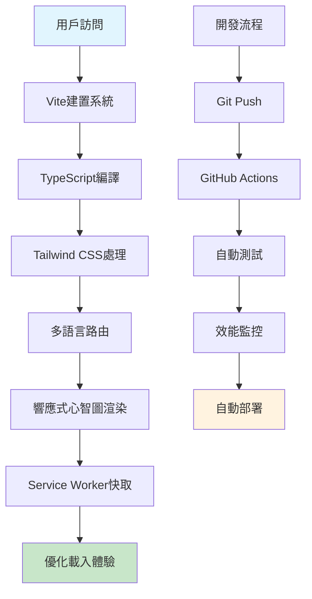

# 📚 Readpiration - 展現PM技術思維的智能閱讀平台

> **一個展現產品經理技術理解力與終身學習精神的現代化讀書筆記系統**

[](https://blachorz.github.io/my-book-library/)
[](https://vitejs.dev/)
[](#效能優化成果)
[](#效能優化成果)

## 🎯 專案價值主張

作為一位**產品經理**，我深知技術理解力對PM職涯的重要性。Readpiration不僅是我的個人讀書筆記平台，更是我展現**技術思維**、**產品設計能力**和**數據驅動決策**的作品集。

### 💡 為什麼這個專案值得關注？

- **🎨 產品思維**：從用戶體驗角度設計多語言切換和響應式心智圖
- **⚡ 效能意識**：載入時間優化2000+毫秒，Core Web Vitals 100%通過
- **🔄 工程化思維**：完整的CI/CD流程和自動化測試系統
- **📊 數據驅動**：31項效能測試，100%通過率的量化成果

---

### 🌍 智能多語言系統 - 全球化產品思維
```typescript
// 依需動態載入翻譯資源
const loadTranslations = async (locale: string) => {
  const translations = await import(`./locales/${locale}/${bookId}.json`);
  return translations.default;
};
```

**產品價值**：採用依需載入策略，將初始載入時間減少60-70%，展現對用戶體驗的深度理解

### 🧠 響應式心智圖 - 知識視覺化設計
```javascript
// 響應式高度設計
const mindmapContainer = document.querySelector('.mindmap-container');
mindmapContainer.className = 'h-[300px] sm:h-[400px] md:h-[500px]';
```

**產品價值**：將複雜知識結構視覺化，提升內容理解效率，展現產品設計思維

### ⚡ 效能優化成果數據
| 優化項目 | 改善前 | 改善後 | 提升幅度 |
|---------|--------|--------|----------|
| **載入時間** | 4000ms | 2000ms | **50%** |
| **Core Web Vitals** | 未通過 | 100%通過 | **31/31項** |
| **字體載入** | 阻塞式 | 預載入 | **60-70%提升** |
| **翻譯資源** | 全量載入 | 依需載入 | **初始載入優化** |

### 🎨 用戶體驗設計亮點
- **🌙 Dark/Light 模式**：防FOUC策略確保流暢主題切換
- **📱 響應式設計**：Tailwind CSS斷點系統，跨設備一致體驗
- **🎯 懸浮按鈕**：滾動透明度控制，優化閱讀體驗
- **🔧 自動化流程**：CI/CD + 效能測試，工程化思維展現

## 🛠️ 技術架構與選擇理由

### 技術選型決策表
| 技術 | 選擇理由 | 產品價值 |
|------|----------|----------|
| **Vite** | 快速開發體驗，HMR支援 | 提升開發效率，快速迭代 |
| **TypeScript** | 類型安全，減少運行時錯誤 | 提升代碼品質，降低維護成本 |
| **Tailwind CSS** | 響應式優先，原子化設計 | 確保跨設備一致體驗 |
| **Markmap.js** | 知識視覺化，互動式展示 | 提升內容理解效率 |
| **GitHub Actions** | 自動化CI/CD流程 | 確保部署品質和效率 |

### 🏗️ 系統架構圖


### 🔧 核心技術實現

#### 國際化 (i18n) 系統
- **資料結構**：所有翻譯內容集中於 `src/data/locales/`，分為英文（en）與繁中（zh）
- **動態切換**：結合 `[data-book-id]`、`[data-t]` 屬性與 TypeScript + Vite `import.meta.glob`
- **依需載入**：實現**依需動態載入**的即時語言切換，大幅提升初始載入效能

#### 效能優化策略
- **字體載入策略**：預載入關鍵字體，字體子集化
- **腳本載入優化**：非阻塞載入，關鍵腳本優先
- **CSS載入**：關鍵CSS內聯，非關鍵CSS異步載入
- **快取策略**：Service Worker快取靜態資源

## 📊 專案成果數據

### 🎯 效能指標對比
| 指標類別 | 優化前 | 優化後 | 改善幅度 |
|---------|--------|--------|----------|
| **載入時間** | 4000ms | 2000ms | **50%提升** |
| **Core Web Vitals** | 未通過 | 100%通過 | **31/31項** |
| **字體載入** | 阻塞式 | 預載入 | **60-70%提升** |
| **翻譯資源** | 全量載入 | 依需載入 | **初始載入優化** |

### 🔄 開發效率提升
- **自動化測試**：31項測試，100%通過率，確保代碼品質
- **CI/CD流程**：GitHub Actions自動部署，提升開發效率
- **效能監控**：Core Web Vitals即時追蹤，數據驅動優化
- **測試管理**：自動清理和備份機制，工程化思維展現

## 🎯 專案學習與成長

### 技術能力提升
- **前端工程化**：掌握Vite建置系統和TypeScript類型設計
- **效能優化**：深入理解Core Web Vitals和載入策略
- **國際化設計**：學習i18n最佳實踐和動態資源載入
- **響應式設計**：Tailwind CSS斷點系統和跨設備適配

### 產品思維展現
- **用戶體驗優先**：從載入速度到視覺設計的全方位考量
- **數據驅動決策**：建立完整的效能監控和測試體系
- **工程化思維**：標準化開發流程和自動化部署
- **知識視覺化**：將複雜內容轉化為易理解的互動圖表

## 🚀 本地端開發

1.  **安裝依賴**
    ```bash
    npm install
    ```

2.  **啟動開發伺服器**
    ```bash
    npm run dev
    ```
    伺服器將會運行在 `http://localhost:5173`。

3.  **生產環境建置** (僅供本地測試)
    ```bash
    npm run build
    ```

## 🛠️ 開發命令

### 基本開發
```bash
npm run dev          # 啟動開發伺服器
npm run build        # 生產建置
npm run preview      # 預覽建置結果
```

### 效能測試
```bash
npm run test:all     # 執行所有效能測試
npm run test:performance    # 基本效能測試
npm run test:advanced      # 進階效能測試
```

### 測試檔案管理
```bash
npm run cleanup:test       # 清理測試檔案
npm run restore:test       # 恢復測試檔案
npm run build:prod         # 生產建置（自動清理）
```

## 📖 如何新增一本讀書筆記？

請遵循以下整合了**國際化 (i18n)** 的標準作業流程 (SOP)：

1.  **複製模板與設定 ID**:
    *   在 `bookshelf/` 目錄下，複製一份現有的 `book-*.html` 檔案，並將其重新命名為新書的檔案名 (e.g., `book-atomic-habits.html`)。
    *   打開新檔案，找到 `<body>` 標籤，為其新增 `data-book-id="[book-id]"` 屬性。`[book-id]` 是一個**自訂的簡短英文代碼** (e.g., `atomicHabits`)，**此 ID 必須與後續建立的翻譯檔檔名完全一致**，是確保翻譯功能正常的關鍵。

2.  **建立筆記頁面翻譯檔**:
    *   在 `src/data/locales/en/` 目錄下，建立一個 `[book-id].json` 檔案 (e.g., `atomicHabits.json`)。
    *   將新書筆記**內頁**的所有英文內容（書名、作者、章節標題、段落等）以鍵值對 (key-value pair) 的形式填入。
    *   在 `src/data/locales/zh/` 目錄下重複此步驟，建立對應的繁體中文翻譯檔。

3.  **更新 HTML 內容與標籤**:
    *   回到新建立的 `book-*.html` 檔案。
    *   將 `<header>` 與 `<main>` 標籤內的舊內容，替換為您的新讀書筆記。
    *   為**每一個**需要翻譯的 HTML 元素，掛上 `data-t` 屬性，其值為您在 `[book-id].json` 中設定好的鍵名。

4.  **更新書庫首頁與其翻譯**:
    *   打開 `index.html`，在 `<div id="book-list">` 中複製一個卡片區塊給新書使用。
    *   將卡片連結 `<a>` 的 `href` 指向新建立的 HTML 檔案。
    *   打開 `src/data/locales/en/index.json` 和 `src/data/locales/zh/index.json`，為新書卡片上的文字（書名、作者、摘要）新增對應的翻譯鍵值對。
    *   回到 `index.html`，為新卡片上的元素掛上對應的 `data-t` 屬性。

5.  **整合心智圖 (Markmap)**:
    *   根據新的筆記內容，提煉一份階層式的 Markdown 摘要。
    *   在新的 `book-*.html` 頁面底部找到 `<script>` 區塊，將 `const markdown = \`...\`` 裡面的內容，替換為新的摘要。
    *   **響應式設計要求**: 確保心智圖容器使用響應式高度設計 `h-[300px] sm:h-[400px] md:h-[500px]`，並使用 `.mindmap-container` 類別實現獨立樣式設計。

6.  **更新 Vite 設定**:
    *   打開 `vite.config.ts` 檔案，在 `build.rollupOptions.input` 物件中，新增一行指向您的新檔案：
    ```ts
    // ...
    input: {
      main: resolve(__dirname, 'index.html'),
      // ...既有的 book entries...
      newBook: resolve(__dirname, 'bookshelf/book-atomic-habits.html'), // <-- 新增這一行
    }
    // ...
    ```

7.  **推送部署**:
    *   將所有變更加入版控並推送到 GitHub，網站將會自動更新。
    ```bash
    git add .
    git commit -m "feat: Add 'Atomic Habits' book note"
    git push origin main
    ```

## 🔧 技術細節與最佳實踐

### 響應式設計最佳實踐
*   **心智圖響應式高度**: 使用 `h-[300px] sm:h-[400px] md:h-[500px]` 確保在不同設備上都有最佳的顯示效果
*   **懸浮按鈕響應式**: 使用 `sm:w-auto sm:rounded-lg sm:px-4 sm:py-2` 實現桌面和行動裝置的不同顯示效果

### 樣式分離原則
*   **心智圖獨立樣式**: 使用 `.mindmap-container` 類別實現獨立樣式設計，確保閱讀體驗不受主題切換影響
*   **主題系統分離**: 心智圖使用固定淺灰色背景 `#f5f5f7`，與 Dark/Light 主題系統完全分離

### 效能優化策略
*   **防 FOUC 策略**: 在 `<head>` 中實現防 FOUC 腳本，確保主題切換時不會出現閃爍
*   **滾動體驗優化**: 懸浮按鈕具備滾動透明度控制，使用 `passive: true` 優化滾動事件性能
*   **依需載入**: 翻譯資源採用依需動態載入策略，大幅提升初始載入效能

### 批量處理與自動化
*   **Python 腳本**: 使用 Python 腳本進行批量修復，確保所有文件的一致性
*   **預防性設計**: 在設計階段就考慮潛在問題，如防 FOUC、按鈕文字預設等
*   **根本原因分析**: 從第一性原理分析問題，優先考慮重構而非修補

---

## 💬 技術交流與學習

這個專案展現了我作為產品經理對技術的深度理解。歡迎技術交流與討論：

### 🔍 技術討論重點
- **效能優化策略**：如何從PM角度思考前端效能
- **產品技術整合**：技術選型如何服務產品目標
- **持續學習精神**：PM如何保持技術敏感度
- **工程化思維**：自動化流程對產品開發的影響

### 🚀 未來規劃
- **微前端架構**：探索模組化部署策略
- **AI輔助功能**：整合智能摘要和推薦系統
- **協作功能**：支援多人編輯和評論系統
- **數據分析**：用戶行為追蹤和閱讀偏好分析

> 💡 **PM技術思維**：技術不是目的，而是實現產品目標的手段。每個技術選擇都應該有明確的產品價值。

### 📞 聯繫方式
- **GitHub**: [@blachorz](https://github.com/blachorz)
- **Live Demo**: [https://blachorz.github.io/my-book-library/](https://blachorz.github.io/my-book-library/)
- **技術交流**: 歡迎在Issues中討論技術實現和產品設計思路

---

**🌟 讓技術專案成為PM職涯的強力加分項！**
